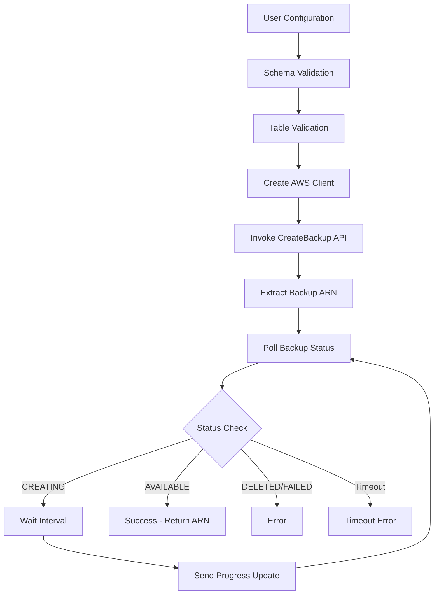
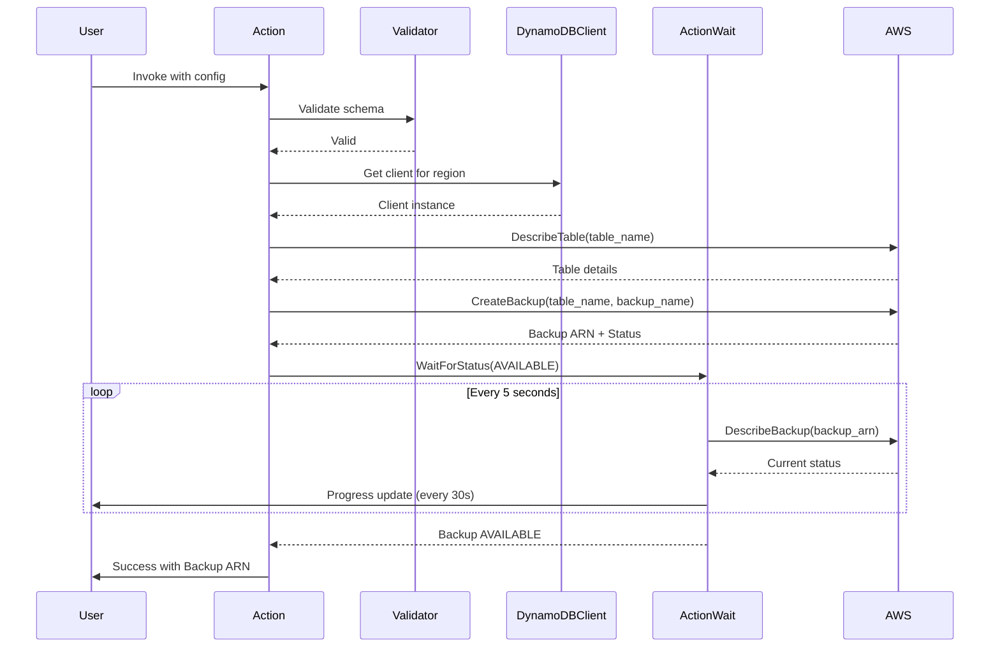

# Design Document: AWS DynamoDB Create Backup Action

## Overview

The AWS DynamoDB Create Backup Action provides an imperative mechanism for creating on-demand backups of DynamoDB tables within Terraform workflows. This action enables users to trigger backup operations at specific lifecycle events (e.g., before destroying a table, after creating a table) without managing separate backup resources.

### Purpose

- Enable on-demand backup creation as part of Terraform lifecycle management
- Provide real-time feedback on backup progress and completion
- Ensure backups are created successfully before proceeding with dependent operations
- Simplify backup workflows by eliminating the need for external scripts or manual intervention

### Use Cases

1. **Pre-Destruction Backups**: Create a backup before destroying a DynamoDB table to preserve data
2. **Post-Deployment Backups**: Create a backup after deploying a table with initial data
3. **Scheduled Backups via Triggers**: Use with `terraform_data` to create backups on a schedule
4. **Migration Workflows**: Create backups before performing major table updates or migrations
5. **Compliance Requirements**: Ensure backups are created at specific points in the infrastructure lifecycle

## Architecture

### High-Level Flow



### Component Interaction



## Components and Interfaces

### Action Structure

The action follows the standard Terraform Plugin Framework action pattern:

```go
type actionType struct {
    framework.ActionWithConfigure
}

type actionModel struct {
    TableName  fwtypes.String `tfsdk:"table_name"`
    BackupName fwtypes.String `tfsdk:"backup_name"`
    Timeout    types.Int64    `tfsdk:"timeout"`
    BackupARN  fwtypes.String `tfsdk:"backup_arn"`
    framework.WithRegionModel
}
```

### Schema Definition

The action implements the `action.Action` interface with the following methods:

- `Metadata()`: Returns action type name "aws_dynamodb_create_backup"
- `Schema()`: Defines input/output parameters
- `Invoke()`: Contains the main action logic

### AWS SDK Integration

The action uses the AWS SDK for Go v2 DynamoDB client:

```go
conn := a.Meta().DynamoDBClient(ctx)
```

Key AWS API operations:
- `DescribeTable`: Validates table existence and status
- `CreateBackup`: Initiates the backup operation
- `DescribeBackup`: Polls for backup completion status

## Data Models

### Action Schema

| Attribute | Type | Required | Computed | Default | Description |
|-----------|------|----------|----------|---------|-------------|
| `table_name` | String | Yes | No | - | Name of the DynamoDB table to backup (or table ARN) |
| `backup_name` | String | Yes | No | - | Name for the backup (3-255 characters, pattern: `[a-zA-Z0-9_.-]+`) |
| `timeout` | Int64 | No | Yes | 1800 | Maximum time in seconds to wait for backup completion (60-7200) |
| `backup_arn` | String | No | Yes | - | ARN of the created backup (output only) |
| `region` | String | No | No | Provider default | AWS region for the operation |

### AWS API Structures

**CreateBackupInput**:
```go
{
    TableName: aws.String("my-table"),
    BackupName: aws.String("my-backup-20250110")
}
```

**CreateBackupOutput**:
```go
{
    BackupDetails: {
        BackupArn: "arn:aws:dynamodb:us-east-1:123456789012:table/my-table/backup/01234567890123-abcdef12",
        BackupName: "my-backup-20250110",
        BackupStatus: "CREATING",
        BackupCreationDateTime: time.Time{...}
    }
}
```

**DescribeBackupOutput**:
```go
{
    BackupDescription: {
        BackupDetails: {
            BackupArn: "...",
            BackupStatus: "AVAILABLE" | "CREATING" | "DELETED"
        }
    }
}
```

## Error Handling

### AWS Error Types and Responses

| AWS Error Type | User-Facing Message | Action |
|----------------|---------------------|--------|
| `TableNotFoundException` | "DynamoDB table '{table_name}' does not exist in region '{region}'" | Return error immediately |
| `BackupNotFoundException` | "Backup '{backup_arn}' was not found during status check" | Retry up to 3 times, then error |
| `BackupInUseException` | "There is another ongoing conflicting backup operation on the table. A backup is either being created, deleted or restored." | Return error immediately |
| `TableInUseException` | "Table '{table_name}' is either being created or deleted. Wait for the operation to complete." | Return error immediately |
| `ContinuousBackupsUnavailableException` | "Backups have not yet been enabled for table '{table_name}'" | Return error immediately |
| `LimitExceededException` | "Account limit exceeded. Up to 500 simultaneous table operations are allowed. Reduce concurrent operations and retry." | Return error immediately |
| `InternalServerError` | "AWS service error occurred. Please retry the operation." | Retry up to 3 times, then error |
| Context timeout | "Backup creation timed out after {timeout}s. Current status: {status}. Backup ARN: {arn}" | Return error with current state |

### Validation Errors

| Validation | Error Message |
|------------|---------------|
| Empty table name | "table_name is required and cannot be empty" |
| Empty backup name | "backup_name is required and cannot be empty" |
| Invalid backup name format | "backup_name must contain only alphanumeric characters, hyphens, underscores, and periods (pattern: [a-zA-Z0-9_.-]+)" |
| Backup name too short | "backup_name must be at least 3 characters (got {length})" |
| Backup name too long | "backup_name must be 255 characters or less (got {length})" |
| Timeout too low | "timeout must be at least 60 seconds (got {value})" |
| Timeout too high | "timeout must be at most 7200 seconds (got {value})" |
| Invalid region format | "region must be a valid AWS region identifier" |

### Error Handling Strategy

1. **Immediate Failures**: Return errors immediately for validation failures and non-retryable AWS errors
2. **Retryable Errors**: Retry transient errors (InternalServerError, throttling) up to 3 times with exponential backoff
3. **Timeout Handling**: When timeout is reached, return error with current backup status and ARN for manual inspection
4. **Context Propagation**: Always respect context cancellation and pass context to all AWS SDK calls

## Design Decisions and Rationales

### Decision 1: Wait for Backup Completion

**Decision**: The action waits until the backup reaches AVAILABLE status before returning, polling the status periodically.

**Rationale**:
- Provides immediate feedback on backup success or failure
- Consistent with other async job submission actions in the provider
- Users expect synchronous behavior for backup operations in Terraform workflows
- Enables dependent operations to proceed only after backup is confirmed

**Alternatives Considered**:
- Return immediately after initiating backup (fire-and-forget)
- Make waiting optional via a `wait_for_completion` parameter

**Trade-offs**:
- **Chosen approach**: Longer action execution time, but simpler user experience and better error detection
- **Fire-and-forget**: Faster execution, but no confirmation of success and potential for silent failures
- **Optional waiting**: More flexible, but adds complexity and most users would want to wait anyway

### Decision 2: Require Backup Name (No Auto-Generation)

**Decision**: Require backup_name as a mandatory parameter, following the AWS API requirement.

**Rationale**:
- AWS CreateBackup API requires BackupName as a mandatory field
- Forces users to provide meaningful, identifiable names for their backups
- Prevents accidental creation of backups with auto-generated names that may not follow user's naming conventions
- Aligns with AWS API design and Terraform's explicit configuration philosophy

**Alternatives Considered**:
- Auto-generate backup name using pattern `terraform-backup-{table-name}-{timestamp}`
- Make backup name optional with auto-generation fallback

**Trade-offs**:
- **Chosen approach**: Requires more configuration but ensures intentional, meaningful names
- **Auto-generation**: More convenient but may create naming inconsistencies and clutter
- Users who want timestamp-based names can use Terraform's `timestamp()` function in their configuration

### Decision 3: Use actionwait Package for Polling

**Decision**: Use the `internal/actionwait` package for implementing status polling with progress reporting.

**Rationale**:
- Provides consistent polling behavior across all actions
- Built-in support for progress updates at configurable intervals
- Handles timeout management and context cancellation
- Reduces boilerplate code and potential for bugs

**Alternatives Considered**:
- Implement custom polling loop
- Use AWS SDK waiters

**Trade-offs**:
- **Chosen approach**: Consistent with provider patterns, less code, but adds dependency
- **Custom loop**: More control but more code and potential for inconsistency
- **AWS SDK waiters**: Simple but less control over progress reporting

### Decision 4: Validate Table Before Backup

**Decision**: Call DescribeTable API before CreateBackup to validate table existence and status.

**Rationale**:
- Provides clearer error messages when table doesn't exist
- Allows checking table status (ACTIVE vs DELETING)
- Fails fast before initiating backup operation
- Reduces wasted API calls and user confusion

**Alternatives Considered**:
- Skip validation and rely on CreateBackup error
- Make validation optional

**Trade-offs**:
- **Chosen approach**: Extra API call but better UX
- **No validation**: Fewer API calls but less clear errors
- **Optional validation**: More flexible but adds complexity

### Decision 5: Default Timeout of 30 Minutes

**Decision**: Set default timeout to 1800 seconds (30 minutes) with range of 60-7200 seconds.

**Rationale**:
- DynamoDB backups typically complete within 5-15 minutes for most tables
- 30 minutes provides buffer for large tables without being excessive
- Aligns with other action timeout defaults in the provider
- Prevents indefinite waiting while allowing for large table backups

**Alternatives Considered**:
- Shorter default (10 minutes)
- Longer default (1 hour)
- No maximum limit

**Trade-offs**:
- **Chosen approach**: Balanced for most use cases
- **Shorter**: Faster failure detection but may timeout on large tables
- **Longer**: More tolerance but longer wait on failures
- **No limit**: Maximum flexibility but risk of indefinite hangs

## Security Considerations

### IAM Permissions

The action requires the following IAM permissions:

**Required**:
- `dynamodb:CreateBackup` - Create the backup
- `dynamodb:DescribeBackup` - Poll backup status
- `dynamodb:DescribeTable` - Validate table existence

**Example IAM Policy**:
```json
{
  "Version": "2012-10-17",
  "Statement": [
    {
      "Effect": "Allow",
      "Action": [
        "dynamodb:CreateBackup",
        "dynamodb:DescribeBackup",
        "dynamodb:DescribeTable"
      ],
      "Resource": [
        "arn:aws:dynamodb:*:*:table/*",
        "arn:aws:dynamodb:*:*:table/*/backup/*"
      ]
    }
  ]
}
```

### Data Exposure

- **Backup ARN**: Returned as output, contains account ID and table name (not sensitive)
- **Table Name**: User-provided input, logged in progress messages
- **Error Messages**: May contain table names and backup names, but no table data
- **Logs**: Debug logs may contain API request/response metadata but not table contents

### Input Validation

- **Table Name**: Validated against AWS naming requirements (3-255 characters, alphanumeric and special chars)
- **Backup Name**: Sanitized to allow only alphanumeric, hyphens, and underscores
- **Timeout**: Range-checked to prevent unreasonable values
- **Region**: Validated against known AWS region identifiers

### Error Message Safety

- Error messages include resource identifiers (table name, backup ARN) but never table data
- AWS error messages are passed through but sanitized to remove any sensitive details
- Stack traces are not included in user-facing error messages

## Performance Considerations

### API Rate Limits

- **CreateBackup**: 50 requests per second per account (AWS limit)
- **DescribeBackup**: 10 requests per second per account (AWS limit)
- **DescribeTable**: 10 requests per second per account per region (AWS limit)

**Mitigation**:
- Polling interval of 5 seconds reduces DescribeBackup call frequency
- Single DescribeTable call at start minimizes impact
- AWS SDK automatic retry with exponential backoff handles throttling

### Concurrent Operations

- **Maximum Simultaneous Table Operations**: Up to 500 simultaneous table operations per account (includes CreateTable, UpdateTable, DeleteTable, RestoreTableFromBackup, etc.)
- **No Limit on Backup Count**: There is no limit to the number of on-demand backups that can be taken
- **Action Concurrency**: No internal limit, respects AWS service limits
- **Recommendation**: Users should be aware of the 500 concurrent table operations limit when triggering multiple backups

### Resource Consumption

- **Memory**: Minimal (~1-2 MB per action invocation)
- **CPU**: Low, mostly waiting on I/O
- **Network**: ~5-10 KB per API call, polling every 5 seconds
- **Duration**: Typically 5-15 minutes for most tables, up to configured timeout

### Throughput Impact

- **Table Performance**: Backup creation has minimal impact on table read/write performance
- **Provider Performance**: Action execution blocks until completion, but doesn't impact other Terraform operations
- **AWS Account**: Backup operations count against account-level backup limits

## Dependencies

### Required Packages

```go
// AWS SDK v2
github.com/aws/aws-sdk-go-v2/aws
github.com/aws/aws-sdk-go-v2/service/dynamodb
github.com/aws/aws-sdk-go-v2/service/dynamodb/types

// Terraform Plugin Framework
github.com/hashicorp/terraform-plugin-framework/action
github.com/hashicorp/terraform-plugin-framework/action/schema
github.com/hashicorp/terraform-plugin-framework/types
github.com/hashicorp/terraform-plugin-framework/types/basetypes
github.com/hashicorp/terraform-plugin-framework-validators/int64validator
github.com/hashicorp/terraform-plugin-framework-validators/stringvalidator

// Provider Internal
github.com/hashicorp/terraform-provider-aws/internal/framework
github.com/hashicorp/terraform-provider-aws/internal/framework/types as fwtypes
github.com/hashicorp/terraform-provider-aws/internal/actionwait
github.com/hashicorp/terraform-provider-aws/internal/conns
github.com/hashicorp/terraform-provider-aws/internal/errs
github.com/hashicorp/terraform-provider-aws/internal/errs/fwdiag

// Logging
github.com/hashicorp/terraform-plugin-log/tflog

// Standard Library
context
errors
fmt
time
regexp
```

## Testing Strategy

### Test Scenarios

1. **Basic Backup Creation**
   - Create backup with minimal configuration
   - Verify backup ARN is returned
   - Verify backup exists in AWS
   - Verify backup status is AVAILABLE

2. **Custom Backup Name**
   - Create backup with custom name
   - Verify backup uses specified name
   - Verify name validation (invalid characters)
   - Verify name length validation

3. **Auto-Generated Name**
   - Create backup without specifying name
   - Verify name follows pattern `terraform-backup-{table}-{timestamp}`
   - Verify name is unique across multiple invocations

4. **Timeout Configuration**
   - Test with custom timeout value
   - Test timeout validation (too low, too high)
   - Test actual timeout behavior (mock slow backup)

5. **Table Validation**
   - Test with non-existent table
   - Test with table in DELETING status
   - Test with table in different region

6. **Error Handling**
   - Test LimitExceededException (too many backups)
   - Test BackupInUseException (duplicate name)
   - Test ResourceNotFoundException
   - Test IAM permission errors

7. **Progress Reporting**
   - Verify progress messages are sent
   - Verify progress includes status and elapsed time
   - Verify final success message

8. **Regional Configuration**
   - Test with explicit region parameter
   - Test with provider default region
   - Test with invalid region

9. **Trigger-Based Invocation**
   - Test with `before_destroy` trigger
   - Test with `after_create` trigger
   - Verify backup is created before resource destruction

### Acceptance Test Structure

```go
func TestAccDynamoDBCreateBackupAction_basic(t *testing.T) {
    ctx := acctest.Context(t)
    rName := sdkacctest.RandomWithPrefix(acctest.ResourcePrefix)
    
    resource.ParallelTest(t, resource.TestCase{
        PreCheck:                 func() { acctest.PreCheck(ctx, t) },
        ProtoV5ProviderFactories: acctest.ProtoV5ProviderFactories,
        TerraformVersionChecks: []tfversion.TerraformVersionCheck{
            tfversion.SkipBelow(tfversion.Version1_14_0),
        },
        Steps: []resource.TestStep{
            {
                Config: testAccDynamoDBCreateBackupActionConfig_basic(rName),
                Check: resource.ComposeTestCheckFunc(
                    testAccCheckDynamoDBBackupExists(ctx, rName),
                ),
            },
        },
    })
}
```

### Sweep Function

Implement sweep function to clean up test backups:

```go
func sweepBackups(region string) error {
    ctx := context.Background()
    client := /* get DynamoDB client for region */
    
    // List all tables
    tables, err := client.ListTables(ctx, &dynamodb.ListTablesInput{})
    if err != nil {
        return err
    }
    
    var sweeperErrs *multierror.Error
    
    // For each table, list and delete test backups
    for _, tableName := range tables.TableNames {
        backups, err := client.ListBackups(ctx, &dynamodb.ListBackupsInput{
            TableName: aws.String(tableName),
        })
        if err != nil {
            sweeperErrs = multierror.Append(sweeperErrs, err)
            continue
        }
        
        for _, backup := range backups.BackupSummaries {
            backupName := aws.ToString(backup.BackupName)
            
            // Only delete test backups
            if !strings.HasPrefix(backupName, "terraform-backup-tf-acc-test") &&
               !strings.HasPrefix(backupName, "tf-acc-test") {
                continue
            }
            
            _, err := client.DeleteBackup(ctx, &dynamodb.DeleteBackupInput{
                BackupArn: backup.BackupArn,
            })
            if err != nil {
                sweeperErrs = multierror.Append(sweeperErrs, err)
            }
        }
    }
    
    return sweeperErrs.ErrorOrNil()
}
```

## Implementation Details

### Polling Implementation

Use the `actionwait` package for consistent polling behavior:

```go
result, err := actionwait.WaitForStatus(ctx,
    func(ctx context.Context) (actionwait.FetchResult[*types.BackupDescription], error) {
        output, err := conn.DescribeBackup(ctx, &dynamodb.DescribeBackupInput{
            BackupArn: aws.String(backupARN),
        })
        if err != nil {
            return actionwait.FetchResult[*types.BackupDescription]{}, err
        }
        
        backup := output.BackupDescription
        return actionwait.FetchResult[*types.BackupDescription]{
            Status: actionwait.Status(backup.BackupDetails.BackupStatus),
            Value:  backup,
        }, nil
    },
    actionwait.Options[*types.BackupDescription]{
        Timeout:            timeout,
        Interval:           actionwait.FixedInterval(5 * time.Second),
        SuccessStates:      []actionwait.Status{"AVAILABLE"},
        TransitionalStates: []actionwait.Status{"CREATING"},
        ProgressInterval:   30 * time.Second,
        ProgressSink: func(fr actionwait.FetchResult[any], meta actionwait.ProgressMeta) {
            resp.SendProgress(action.InvokeProgressEvent{
                Message: fmt.Sprintf("Backup status: %s, Elapsed: %v", 
                    fr.Status, meta.Elapsed.Round(time.Second)),
            })
        },
    },
)
```

### Backup Name Validation

```go
var backupNameRegex = regexp.MustCompile(`^[a-zA-Z0-9_.-]+$`)

func validateBackupName(name string) error {
    if len(name) < 3 {
        return fmt.Errorf("backup_name must be at least 3 characters (got %d)", len(name))
    }
    if len(name) > 255 {
        return fmt.Errorf("backup_name must be 255 characters or less (got %d)", len(name))
    }
    if !backupNameRegex.MatchString(name) {
        return fmt.Errorf("backup_name must contain only alphanumeric characters, hyphens, underscores, and periods")
    }
    return nil
}
```

### Table Validation

```go
func validateTable(ctx context.Context, conn *dynamodb.Client, tableName string) error {
    output, err := conn.DescribeTable(ctx, &dynamodb.DescribeTableInput{
        TableName: aws.String(tableName),
    })
    if err != nil {
        var notFound *types.ResourceNotFoundException
        if errors.As(err, &notFound) {
            return fmt.Errorf("DynamoDB table %q was not found", tableName)
        }
        return err
    }
    
    if output.Table.TableStatus != types.TableStatusActive {
        return fmt.Errorf("DynamoDB table %q is in %s status, must be ACTIVE", 
            tableName, output.Table.TableStatus)
    }
    
    return nil
}
```

### Schema Validators

```go
"backup_name": schema.StringAttribute{
    Required:    true,
    Description: "Name for the backup (3-255 characters)",
    Validators: []validator.String{
        stringvalidator.LengthBetween(3, 255),
        stringvalidator.RegexMatches(
            regexp.MustCompile(`^[a-zA-Z0-9_.-]+$`),
            "must contain only alphanumeric characters, hyphens, underscores, and periods",
        ),
    },
},
"timeout": schema.Int64Attribute{
    Optional:    true,
    Computed:    true,
    Description: "Maximum time in seconds to wait for backup completion",
    Default:     int64default.StaticInt64(1800),
    Validators: []validator.Int64{
        int64validator.Between(60, 7200),
    },
},
```

## Implementation Findings

### AWS Service Requirements

**Point-in-Time Recovery Prerequisite**

DynamoDB tables must have point-in-time recovery (continuous backups) enabled before on-demand backups can be created. This is an AWS service requirement:

- Without PITR enabled, CreateBackup API returns `ContinuousBackupsUnavailableException`
- All test tables must include:
  ```hcl
  point_in_time_recovery {
    enabled = true
  }
  ```
- This requirement should be documented in user-facing documentation
- Error message from AWS is clear: "Backups have not yet been enabled for table"

### Terraform 1.14.0 Action Limitations

**Supported Lifecycle Events**

Terraform 1.14.0 actions support only the following lifecycle events:
- `before_create` - Before resource creation
- `after_create` - After resource creation
- `before_update` - Before resource update
- `after_update` - After resource update

**Not Supported**:
- `before_destroy` - Not available in Terraform 1.14.0
- `after_destroy` - Not available in Terraform 1.14.0

Attempting to use unsupported events results in: "Invalid event value before_destroy"

### Testing Insights

**Multi-Region Testing Pattern**

For testing actions with explicit region parameters:
- Use `ConfigMultipleRegionProvider(2)` to set up multiple providers
- Use `ProtoV5FactoriesMultipleRegions(ctx, t, 2)` for provider factories
- Create resources in alternate region using `provider = awsalternate`
- Action can specify explicit region parameter independent of resource provider

**Error Pattern Matching**

Terraform wraps action errors with additional context, requiring flexible regex patterns:
- Use `(?s)` flag for multi-line matching: `regexache.MustCompile(\`(?s)Pattern.*text\`)`
- Match on key phrases rather than exact error text
- Example: `(?s)Table Validation Failed.*does not exist` matches multi-line error output

**Test Patterns Not Applicable**

Some test patterns don't apply to lifecycle-triggered actions:
- **Duplicate Name Tests**: Actions trigger on lifecycle events, not config reapplication
  - Applying same config twice doesn't re-trigger the action
  - Duplicate backup errors only occur with simultaneous operations (not testable)
- **Before Destroy Tests**: Event not supported in Terraform 1.14.0

### Performance Characteristics

**Backup Creation Timing**

Based on acceptance test results:
- Basic backup creation: ~25-35 seconds for small test tables
- Includes table creation, PITR enablement, backup creation, and polling
- Polling interval: 5 seconds
- Progress updates: Every 30 seconds
- Total test suite (5 tests): ~133 seconds

**Resource Cleanup**

Test backups persist after tests complete:
- Sweep function needed for cleanup
- Backups are independent of table lifecycle
- Must explicitly delete backups in cleanup

## Future Enhancements

Potential future improvements (not in scope for initial implementation):

1. **Backup Retention Management**
   - Automatically delete old backups when creating new ones
   - Support for backup retention policies

2. **Cross-Region Backup Copy**
   - Copy backups to different regions for disaster recovery
   - Integrate with AWS Backup service

3. **Batch Backup Creation**
   - Create backups for multiple tables in a single action
   - Support for table name patterns/filters

4. **Backup Verification**
   - Validate backup integrity after creation
   - Compare backup size with table size

5. **Cost Estimation**
   - Estimate backup storage costs
   - Warn when approaching backup limits

6. **Integration with Backup Vault**
   - Store backups in AWS Backup vault
   - Apply lifecycle policies to backups

7. **Incremental Backup Support**
   - Support for point-in-time recovery (PITR) backups
   - Differential backup strategies
