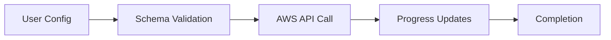

---
inclusion: fileMatch
fileMatchPattern: ['**/internal/service/**/*action*.go', '**/website/docs/actions/**']
---

# Terraform Actions Implementation Guide

## Overview

Terraform Actions enable imperative operations during the Terraform lifecycle. Actions are experimental features that allow performing AWS operations at specific lifecycle events (before/after create, update, destroy).

## Documentation Location

Action documentation is located in `/website/docs/actions/` with one markdown file per action. For example:
- `cloudfront_create_invalidation.html.markdown`
- `codebuild_start_build.html.markdown`
- `ec2_stop_instance.html.markdown`
- `events_put_events.html.markdown`
- `lambda_invoke.html.markdown`
- `s3_empty_bucket.html.markdown`
- `ses_send_email.html.markdown`
- `sfn_start_execution.html.markdown`
- `sns_publish.html.markdown`
- `ssm_send_command.html.markdown`
- `transcribe_start_transcription_job.html.markdown`

Each documentation file follows a consistent structure with examples, argument reference, and usage notes.

## Requirements Document Structure

### Glossary (Required)
Every requirements document must include a glossary defining:
- **Action-specific terminology** - Terms unique to this action
- **AWS service concepts** - Service-specific terms (e.g., "Backup_Operation", "Command_Invocation")
- **Terraform framework terms** - Plugin framework concepts
- **Domain-specific language** - Any specialized terminology

Example glossary entries:
- **Action**: A Terraform Plugin Framework construct for imperative operations
- **DynamoDB_Service**: The AWS DynamoDB service implementation within the provider
- **Backup_Operation**: The AWS DynamoDB CreateBackup API operation
- **Acceptance_Test**: Integration tests that run against real AWS infrastructure

## Design Document Structure

### Required Sections

1. **Overview** - Purpose and use cases
2. **Architecture** - Component structure and flow diagrams
3. **Components and Interfaces** - Detailed implementation specs
4. **Data Models** - Schema and AWS API structures
5. **Error Handling** - All error cases and messages
6. **Testing Strategy** - Test approach and scenarios
7. **Implementation Details** - Specific implementation notes

### Design Decisions and Rationales (Required)

Document major design decisions with:
- **Decision**: What was decided
- **Rationale**: Why it was decided (business/technical reasons)
- **Alternatives**: What else was considered
- **Trade-offs**: What was gained/lost

Example:
```markdown
### Decision: Wait for Backup Completion

**Decision**: The action waits until the backup is complete, periodically polling for completion.

**Rationale**: 
- Provides immediate feedback on success/failure
- Consistent with other AWS provider actions
- Users expect synchronous behavior for backup operations

**Alternatives Considered**:
- Return immediately after initiating backup
- Make waiting optional via parameter

**Trade-offs**:
- Longer action execution time
- Simpler user experience
- Better error detection
```

### Security Considerations (Required)

Document security aspects:
- **IAM Permissions**: Required permissions (e.g., `dynamodb:CreateBackup`)
- **Data Exposure**: What data is logged or returned
- **Input Validation**: How inputs are sanitized
- **Error Messages**: Ensure no sensitive data in errors

### Performance Considerations (Required)

Document performance implications:
- **API Rate Limits**: Service-specific limits
- **Concurrent Operations**: Maximum simultaneous operations
- **Resource Consumption**: Memory, CPU, network usage
- **Throughput Impact**: Effect on service performance

### Dependencies (Required)

List all required packages with import paths:
```go
- github.com/aws/aws-sdk-go-v2/service/dynamodb
- github.com/hashicorp/terraform-plugin-framework/action
- github.com/hashicorp/terraform-plugin-log/tflog
- github.com/hashicorp/terraform-provider-aws/internal/actionwait
```

### Future Enhancements (Optional but Recommended)

Document what's NOT in scope:
- Potential improvements
- Known limitations
- Features for future consideration

Example:
```markdown
## Future Enhancements

Potential future improvements (not in scope for initial implementation):
1. Integration with backup vault/lifecycle policies
2. Batch backup creation for multiple tables
3. Backup verification/validation
```

### Visual Documentation (Recommended)

Use mermaid diagrams to visualize:
- High-level flow
- Component interactions
- State transitions

Example:


## Action Implementation Pattern

### File Structure
Actions follow the standard service package structure:
```
internal/service/<service>/
├── <action_name>_action.go       # Action implementation
├── <action_name>_action_test.go  # Action tests
└── service_package_gen.go        # Auto-generated service registration
```

Documentation structure:
```
website/docs/actions/
└── <service>_<action_name>.html.markdown  # User-facing documentation
```

Changelog entry:
```
.changelog/
└── <pr_number_or_description>.txt  # Release note entry
```

### Action Schema Definition

Actions use the Terraform Plugin Framework with a standard schema pattern:

```go
func (a *actionType) Schema(ctx context.Context, req action.SchemaRequest, resp *action.SchemaResponse) {
    resp.Schema = schema.Schema{
        Attributes: map[string]schema.Attribute{
            // Required configuration parameters
            "param_name": schema.StringAttribute{
                Required:    true,
                Description: "Description of parameter",
            },
            // Optional parameters with defaults
            "timeout": schema.Int64Attribute{
                Optional:    true,
                Description: "Operation timeout in seconds",
                Default:     int64default.StaticInt64(1800),
                Computed:    true,
            },
        },
    }
}
```

### Common Schema Issues

**Pay special attention to the schema definition** - it commonly has issues after a first draft:

1. **Type Mismatches**
   - Using `types.String` instead of `fwtypes.String` in model structs
   - Using `types.StringType` instead of `fwtypes.StringType` in schema
   - Mixing framework types with plugin-framework types

2. **List/Map Element Types**
   ```go
   // WRONG - missing ElementType
   "items": schema.ListAttribute{
       Optional: true,
   }
   
   // CORRECT
   "items": schema.ListAttribute{
       Optional:    true,
       ElementType: fwtypes.StringType,
   }
   ```

3. **Computed vs Optional**
   - Attributes with defaults must be both `Optional: true` and `Computed: true`
   - Don't mark action inputs as `Computed` unless they have defaults

4. **Validator Imports**
   ```go
   // Ensure proper imports
   "github.com/hashicorp/terraform-plugin-framework-validators/int64validator"
   "github.com/hashicorp/terraform-plugin-framework-validators/stringvalidator"
   ```

5. **Region Attribute**
   - Always include `framework.WithRegionModel` in model struct
   - Region is automatically added to schema by the framework
   - Don't manually define region in schema

6. **Nested Attributes**
   - Use `fwtypes.ListNestedObjectValueOf[T]` for complex nested structures
   - Ensure nested types are properly defined

### Schema Validation Checklist

Before submitting, verify:
- [ ] All attributes have descriptions
- [ ] List/Map attributes have ElementType defined
- [ ] Validators are imported and applied correctly
- [ ] Model struct uses correct fwtypes (not plugin-framework types)
- [ ] Optional attributes with defaults are marked Computed
- [ ] Region handling uses framework.WithRegionModel
- [ ] Code compiles without type errors
- [ ] Run `go build` to catch type mismatches

### Action Invoke Method

The Invoke method contains the action logic:

```go
func (a *actionType) Invoke(ctx context.Context, req action.InvokeRequest, resp *action.InvokeResponse) {
    var data actionModel
    resp.Diagnostics.Append(req.Config.Get(ctx, &data)...)
    
    // Create AWS client
    conn := a.Meta().Client(ctx)
    
    // Progress updates for long-running operations
    resp.Progress.Set(ctx, "Starting operation...")
    
    // Implement action logic with error handling
    // Use context for timeout management
    // Poll for completion if async operation
    
    resp.Progress.Set(ctx, "Operation completed")
}
```

## Key Implementation Requirements

### 1. Progress Reporting
- Use `resp.SendProgress(action.InvokeProgressEvent{...})` for real-time updates
- Provide meaningful progress messages during long operations
- Update progress at key milestones
- Include elapsed time for long operations

### 2. Timeout Management
- Always include configurable timeout parameter (default: 1800s)
- Use `context.WithTimeout()` for AWS SDK calls
- Handle timeout errors gracefully
- Validate timeout ranges (typically 60-7200 seconds)

### 3. Error Handling
- Add diagnostics with `resp.Diagnostics.AddError()`
- Provide clear error messages with context
- Include AWS error details when relevant
- Map AWS error types to user-friendly messages
- Document all possible error cases

Example error handling:
```go
// Handle specific AWS errors
var resourceNotFound *types.ResourceNotFoundException
if errors.As(err, &resourceNotFound) {
    resp.Diagnostics.AddError(
        "Resource Not Found",
        fmt.Sprintf("DynamoDB table %s was not found", tableName),
    )
    return
}

// Generic error handling
resp.Diagnostics.AddError(
    "Failed to Create Backup",
    fmt.Sprintf("Could not create backup for table %s: %s", tableName, err),
)
```

### 4. AWS SDK Integration
- Use AWS SDK v2 clients from `a.Meta().<Service>Client(ctx)`
- Handle pagination for list operations
- Implement retry logic for transient failures
- Use appropriate AWS error types

### 5. Parameter Validation
- Use framework validators for input validation
- Validate resource existence before operations
- Check for conflicting parameters
- Validate against AWS naming requirements

### 6. Polling and Waiting

For operations that require waiting for completion, use the `actionwait` package:

```go
import "github.com/hashicorp/terraform-provider-aws/internal/actionwait"

result, err := actionwait.WaitForStatus(ctx, 
    func(ctx context.Context) (actionwait.FetchResult[*ResourceType], error) {
        // Fetch current status
        resource, err := findResource(ctx, conn, id)
        if err != nil {
            return actionwait.FetchResult[*ResourceType]{}, err
        }
        return actionwait.FetchResult[*ResourceType]{
            Status: actionwait.Status(resource.Status),
            Value:  resource,
        }, nil
    },
    actionwait.Options[*ResourceType]{
        Timeout:            timeout,
        Interval:           actionwait.FixedInterval(5 * time.Second),
        SuccessStates:      []actionwait.Status{"AVAILABLE", "COMPLETED"},
        TransitionalStates: []actionwait.Status{"CREATING", "PENDING"},
        ProgressInterval:   30 * time.Second,
        ProgressSink: func(fr actionwait.FetchResult[any], meta actionwait.ProgressMeta) {
            resp.SendProgress(action.InvokeProgressEvent{
                Message: fmt.Sprintf("Status: %s, Elapsed: %v", fr.Status, meta.Elapsed.Round(time.Second)),
            })
        },
    },
)
```

**Examples using actionwait:**
- `internal/service/ec2/ec2_stop_instance_action.go`
- `internal/service/bedrockagent/agent_prepare_action.go`
- `internal/service/cloudfront/create_invalidation_action.go`
- `internal/service/transcribe/start_transcription_job_action.go`

## Common Action Patterns

### Batch Operations
**Example:** `s3_empty_bucket`
- Process items in configurable batches
- Report progress per batch
- Handle partial failures gracefully
- Support prefix/filter parameters

### Command Execution
**Example:** `ssm_send_command`
- Submit command and get command ID
- Poll for completion status
- Retrieve and report output
- Handle timeout during polling
- Validate resources exist before execution

### Service Invocation
**Examples:** `lambda_invoke`, `sfn_start_execution`
- Invoke service with parameters
- Wait for completion (if synchronous)
- Return output/results
- Handle service-specific errors

### Resource State Changes
**Example:** `ec2_stop_instance`
- Validate current state
- Apply state change
- Poll for target state
- Handle transitional states

### Event/Message Publishing
**Examples:** `sns_publish`, `events_put_events`, `ses_send_email`
- Validate message format
- Submit to service
- Confirm delivery/acceptance
- Handle throttling

### Cache/CDN Operations
**Example:** `cloudfront_create_invalidation`
- Submit invalidation request
- Get invalidation ID
- Poll for completion
- Report progress

### Async Job Submission
**Examples:** `codebuild_start_build`, `transcribe_start_transcription_job`
- Submit job with configuration
- Get job ID
- Optionally wait for completion
- Report job status

## Action Triggers

Actions are invoked via `action_trigger` lifecycle blocks in Terraform configurations:

```hcl
action "aws_service_action" "name" {
  config {
    parameter = value
  }
}

resource "terraform_data" "trigger" {
  lifecycle {
    action_trigger {
      events  = [before_destroy, after_create]
      actions = [action.aws_service_action.name]
    }
  }
}
```

### Available Trigger Events

**Terraform 1.14.0 Supported Events:**
- `before_create` - Before resource creation
- `after_create` - After resource creation
- `before_update` - Before resource update
- `after_update` - After resource update

**Not Supported in Terraform 1.14.0:**
- `before_destroy` - Not available (will cause validation error)
- `after_destroy` - Not available (will cause validation error)

**Important**: Attempting to use `before_destroy` or `after_destroy` in Terraform 1.14.0 will result in an error: "Invalid event value before_destroy". These events may be added in future Terraform versions, but are not currently supported.

## Testing Actions

### Acceptance Tests
- Test action invocation with valid parameters
- Test timeout scenarios
- Test error conditions
- Verify AWS state changes
- Test progress reporting
- Test with custom parameters
- Test trigger-based invocation

### Test Pattern
```go
func TestAccServiceAction_basic(t *testing.T) {
    ctx := acctest.Context(t)
    
    resource.ParallelTest(t, resource.TestCase{
        PreCheck:                 func() { acctest.PreCheck(ctx, t) },
        ProtoV5ProviderFactories: acctest.ProtoV5ProviderFactories,
        TerraformVersionChecks: []tfversion.TerraformVersionCheck{
            tfversion.SkipBelow(tfversion.Version1_14_0),
        },
        Steps: []resource.TestStep{
            {
                Config: testAccActionConfig_basic(),
                Check: resource.ComposeTestCheckFunc(
                    // Verify action execution
                    testAccCheckResourceExists(ctx, "aws_resource.test"),
                ),
            },
        },
    })
}
```

### Test Cleanup with Sweep Functions

Add sweep functions to clean up test resources:

```go
// In sweep.go
func sweepBackups(region string) error {
    ctx := context.Background()
    client := /* get client for region */
    
    input := &service.ListInput{
        // Filter for test resources
    }
    
    var sweeperErrs *multierror.Error
    
    pages := service.NewListPaginator(client, input)
    for pages.HasMorePages() {
        page, err := pages.NextPage(ctx)
        if err != nil {
            sweeperErrs = multierror.Append(sweeperErrs, err)
            continue
        }
        
        for _, item := range page.Items {
            id := aws.ToString(item.Id)
            
            // Skip non-test resources
            if !strings.HasPrefix(id, "tf-acc-test") {
                continue
            }
            
            _, err := client.Delete(ctx, &service.DeleteInput{
                Id: aws.String(id),
            })
            if err != nil {
                sweeperErrs = multierror.Append(sweeperErrs, err)
            }
        }
    }
    
    return sweeperErrs.ErrorOrNil()
}

func init() {
    resource.AddTestSweepers("aws_service_resource", &resource.Sweeper{
        Name: "aws_service_resource",
        F:    sweepBackups,
    })
}
```

### Testing Best Practices

**Service-Specific Prerequisites**

Always check for service-specific prerequisites that must be met before actions can succeed:

- **DynamoDB Backups**: Tables must have point-in-time recovery (continuous backups) enabled
  ```hcl
  resource "aws_dynamodb_table" "test" {
    # ... other configuration ...
    
    point_in_time_recovery {
      enabled = true
    }
  }
  ```
- **EC2 Instances**: Must be in correct state (running/stopped) for state change actions
- **Lambda Functions**: Must be in Active state before invocation
- Document prerequisites in action documentation and test configurations

**Multi-Region Testing**

For actions that support explicit region parameters:

```go
func TestAccServiceAction_region(t *testing.T) {
    ctx := acctest.Context(t)
    
    resource.Test(t, resource.TestCase{
        PreCheck: func() {
            acctest.PreCheck(ctx, t)
            acctest.PreCheckMultipleRegion(t, 2)
        },
        ProtoV5ProviderFactories: acctest.ProtoV5FactoriesMultipleRegions(ctx, t, 2),
        // ... rest of test
    })
}
```

Configuration pattern:
```go
func testAccActionConfig_region(rName, region string) string {
    return acctest.ConfigCompose(
        acctest.ConfigMultipleRegionProvider(2),
        fmt.Sprintf(`
resource "aws_resource" "test" {
  provider = awsalternate
  # ... configuration ...
}

action "aws_service_action" "test" {
  config {
    resource_id = aws_resource.test.id
    region      = %[2]q
  }
}
`, rName, region))
}
```

**Error Pattern Matching**

Terraform wraps action errors with additional context. Use flexible regex patterns:

```go
// Use (?s) flag for multi-line matching
ExpectError: regexache.MustCompile(`(?s)Error Title.*key phrase`),

// Examples:
ExpectError: regexache.MustCompile(`(?s)Table Validation Failed.*does not exist`),
ExpectError: regexache.MustCompile(`(?s)Backup Operation Failed.*in use`),
```

**Test Patterns Not Applicable to Actions**

Some common test patterns don't apply to lifecycle-triggered actions:

1. **Duplicate Name/Resource Tests**: Actions trigger on lifecycle events, not config reapplication
   - Applying the same config twice doesn't re-trigger the action
   - Duplicate resource errors only occur with simultaneous operations (not testable)
   
2. **Before/After Destroy Tests**: Not supported in Terraform 1.14.0
   - Comment out these tests with explanation
   - May be supported in future Terraform versions

**Test Execution Environment**

For Terraform 1.14.0 action testing:
```bash
# Set Terraform binary path
export TF_ACC_TERRAFORM_PATH=/tmp/terraform

# Run tests
TF_ACC=1 go test ./internal/service/<service> -run TestAccServiceAction_ -v -timeout 30m
```

### Running Tests

Compile test to check for errors:
```bash
go test -c -o /dev/null ./internal/service/<service>
```

Run specific action tests:
```bash
TF_ACC=1 go test ./internal/service/<service> -run TestAccServiceAction_ -v
```

Run without TF_ACC (should skip):
```bash
go test ./internal/service/<service> -run TestAccServiceAction_ -v
```

Run sweep to clean up test resources:
```bash
TF_ACC=1 go test ./internal/service/<service> -sweep=us-west-2 -v
```

## Changelog Entry Format

Create a changelog entry in `.changelog/` directory:

```
.changelog/<pr_number_or_description>.txt
```

Content format:
```release-note:new-action
action/aws_service_action: Brief description of the action
```

Example:
```release-note:new-action
action/aws_ssm_send_command: New action for executing commands on EC2 instances using AWS Systems Manager Run Command
```

## Code Style Conventions

1. **Naming**: Use `<service>_<operation>_action.go` format
2. **Model Structs**: Define typed models for action configuration
3. **Constants**: Define timeout defaults as constants
4. **Logging**: Use `tflog` for debug logging
5. **Documentation**: Include comprehensive inline comments
6. **Error Messages**: Provide actionable error messages with context

## Documentation Standards

Each action documentation file must include:

1. **Front Matter**
   ```yaml
   ---
   subcategory: "Service Name"
   layout: "aws"
   page_title: "AWS: aws_service_action"
   description: |-
     Brief description of what the action does.
   ---
   ```

2. **Header with Warnings**
   - Beta/Alpha notice about experimental status
   - Warning about potential unintended consequences
   - Link to AWS documentation

3. **Example Usage**
   - Basic usage example
   - Advanced usage with all options
   - Trigger-based example with `terraform_data`
   - Real-world use case examples

4. **Argument Reference**
   - List all required and optional arguments
   - Include descriptions and defaults
   - Note any validation rules

5. **Additional Sections** (as needed)
   - Behavior description
   - Prerequisites
   - Common use cases
   - Related AWS documentation links

### Documentation Linting

**IMPORTANT:** All documentation must pass `terrafmt` linting before submission.

Run terrafmt to format Terraform code blocks in documentation:
```bash
terrafmt fmt website/docs/actions/<action_name>.html.markdown
```

Verify formatting:
```bash
terrafmt diff website/docs/actions/<action_name>.html.markdown
```

Common terrafmt issues:
- Incorrect indentation in Terraform code blocks
- Missing or extra blank lines
- Inconsistent spacing around operators
- Improper HCL formatting

## Example Documentation References

For implementation guidance, refer to existing action documentation:
- **Simple invocation**: `lambda_invoke.html.markdown`, `sns_publish.html.markdown`
- **State management**: `ec2_stop_instance.html.markdown`
- **Batch operations**: `s3_empty_bucket.html.markdown`
- **Command execution**: `ssm_send_command.html.markdown`
- **Async jobs**: `codebuild_start_build.html.markdown`, `transcribe_start_transcription_job.html.markdown`

## Common Pitfalls to Avoid

### Runtime Issues
- Don't block indefinitely - always respect timeouts
- Don't ignore partial failures in batch operations
- Don't assume resources exist - validate first
- Don't forget to update progress for long operations
- Don't hardcode timeouts - make them configurable
- Don't skip error context - include resource identifiers

### Schema Issues (Most Common)
- Don't use `types.*` from plugin-framework in model structs - use `fwtypes.*`
- Don't forget `ElementType` on List/Map attributes
- Don't mix Optional without Computed when using defaults
- Don't manually add region to schema - use `framework.WithRegionModel`
- Don't forget to import validators when using them

### Documentation Issues
- Don't skip terrafmt linting - run it before submitting
- Don't forget the beta/alpha warning notice
- Don't omit real-world usage examples
- Don't forget to include prerequisites section

## Pre-Submission Checklist

Before submitting your action implementation:

- [ ] Code compiles: `go build -o /dev/null .`
- [ ] Tests compile: `go test -c -o /dev/null ./internal/service/<service>`
- [ ] Tests run (skip): `go test ./internal/service/<service> -run TestAccAction_`
- [ ] Code formatted: `make fmt`
- [ ] Documentation formatted: `terrafmt fmt website/docs/actions/<action>.html.markdown`
- [ ] Changelog entry created: `.changelog/<description>.txt`
- [ ] Schema uses correct types (fwtypes, not types)
- [ ] All List/Map attributes have ElementType
- [ ] Progress updates implemented for long operations
- [ ] Error messages include context and resource identifiers
- [ ] Documentation includes multiple examples
- [ ] Documentation includes prerequisites and warnings